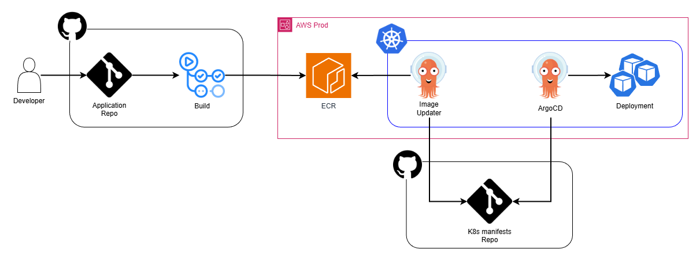

[](https://github.com/Goikkk/multi_account_CICD_github_actions/actions/workflows/cicd.yaml)

# GitOps project
Repository contains Terragrunt code to deploy a container application in AWS.
Application is hosted in AWS EKS.
The build is managed by GitHub Actions and the deployment is done by ArgoCD and Image Updater.

## Architecture

1. Push to `main` or `feature/**` branches triggers the CI workflow.
2. Docker image is build, tagged and pushed to ECR. Tagging:
   - feature branches - `<branch name>-<build number>-<commit sha>`
   - main branch - semantic versioning is used eg: `0.0.4`. Patch version is increased by default. To update other:
     - minor - commit message must contain `[MINOR]`
     - major - commit message must contain `[MAJOR]`
3. ArgoCD Image Updater monitors the ECR and whenever a new semantic image, within ~0 version, is uploaded, commits changes to manifest repository.
4. ArgoCD monitors the repository and updates Kubernetes resources whenever changes are detected.

## Getting Started
### 1. Prerequisites
Tools installed on your local machine:
* [Git](https://git-scm.com/install/)
* [Terraform](https://developer.hashicorp.com/terraform/install)
* [Terragrunt](https://terragrunt.gruntwork.io/docs/getting-started/install/)
* [AWS CLI](https://docs.aws.amazon.com/cli/latest/userguide/getting-started-install.html)

Having the following accounts:
* AWS
* GitHub

### 2. Initial preparation

On GitHub:
* Create repository for infrastructure project (empty, without readme and .gitignore)
  * Add new environment: `prod` (Repo Settings -> Environments -> New environment)
* Create repository for manifests (empty, without readme and .gitignore)
* Generate and save access token (Account Settings -> Developer Settings -> Personal access tokens -> Tokens -> Generate new access token)

Manifest repository:
* Clone [gitops_applications](https://github.com/Goikkk/gitops_applications) repository
* Remove remote origin
* Add origin of your repository
* Update AWS account id in the `gitops_applications/base/simple_app/deployment.yaml` file to yours
* Commit and push to your repository main branch

Infrastructure repository:
* Clone this repository
* Remove remote origin
* Add origin of your repo

Secret creation:
* Login to aws cli (or add parameters in the AWS console)
```bash
aws login
```
* Create ArgoCD admin password parameter
```bash
htpasswd -nbBC 10 "" <YOUR PASSWORD> | tr -d ':\n' | sed 's/$2y/$2a/'
aws ssm put-parameter \
  --name "/argocd/admin-password" \
  --value "<YOUR BCRYPT HASHED PASSWORD>" \
  --type "SecureString" \
  --description "ArgoCD admin password"
```
* Create password change timestamp parameter
```bash
aws ssm put-parameter \
  --name "/argocd/admin-passwordMtime" \
  --value "2025-12-23T08:22:58Z" \
  --type "SecureString" \
  --description "Admin password modification time"
```
* Create secret key (random 32 characters) parameter for ArgoCD 
```bash
aws ssm put-parameter \
  --name "/argocd/server-secretkey" \
  --value "<YOUR SECRET KEY>" \
  --type "SecureString" \
  --description "Secret key for ArgoCD server"
```
* Create git username parameter for Image Updater 
```bash
aws ssm put-parameter \
  --name "/git/username" \
  --value "<YOUR GITHUB USERNAME>" \
  --type "SecureString" \
  --description "Git username for Image Updater"
```
* Create git access token parameter for Image Updater 
```bash
aws ssm put-parameter \
  --name "/git/password" \
  --value "<YOUR PERSONAL ACCESS TOKEN FROM GIT>" \
  --type "SecureString" \
  --description "Git password for Image Updater"
```

### 3. Environment creation
Configuration in infrastructure repository:
* Open file: `infrastructure/config/<ENV>/config.hcl`
* Update `github_repo_url` to point to the manifest repository
* Update `git_subject_claim_values` to point to your infrastructure repository (case-sensitive!)
```
Pattern: 
'repo:<YOUR_ORG>/<YOUR_REPO_NAME>:environment:<ENV>'

Example for this repo and staging environment: 
'repo:Goikkk/gitops_infrastructure:environment:prod'
```
* Update `cluster_admin_arn` to your user / role arn
* The rest of the configuration can stay as default

Deployment:
* Export AWS CLI credentials (if you didn't before)
```bash
aws login
```
* Go to directory with `<ENV>` code
```bash
cd infrastructure/environments/<ENV>/
```
* Deploy infrastructure
```bash
terragrunt run --all apply --backend-bootstrap
```

GitHub environment configuration:
* Get needed information about created infrastructure
```bash
cd <REGION>/github_actions
terragrunt run output
cd ../ecr
terragrunt run output
```
* In GitHub infrastructure repository go to the Settings -> Environments -> `<ENV>` -> Add environment variable. Add following variables:
```
AWS_IAM_ROLE
AWS_REGION
ECR_REPOSITORY_NAME
```

### 4. Application deployment
Now that AWS environment is deployed and configured, we can start CI/CD. 
Commit the changes and push to your infrastructure repository.

Go to Actions page in GitHub and watch how the app is deployed 🎉

You can find application endpoint by checking `nlb_hostname` output:
```bash
cd infrastructure/environments/<ENV>/<REGION>/ingress
terragrunt run output
```
Available endpoints:
* `/health`
* `/version`
* `/argocd`

### 5. Errors

If you get following error in the GitHub workflow:
```
Error: Could not assume role with OIDC: Not authorized to perform sts:AssumeRoleWithWebIdentity
```
This means that the `git_subject_claim_values` variable is not set correctly.
Go to the AWS account of the environment in which you get that error:
```
AWS CloudTrail -> Event history -> Press 'Clear Filters'
```
Set the `Lookup attributes` to `Event name` and value to `AssumeRoleWithWebIdentity`.
Press on the most recent event and check:
```
Event record -> userIdentity -> userName
```
Value of `userName` should be exactly the same as `git_subject_claim_values` (case-sensitive).
If it's not, change `infrastructure/config/<ENV>/config.hcl` config and redeploy infrastructure.
